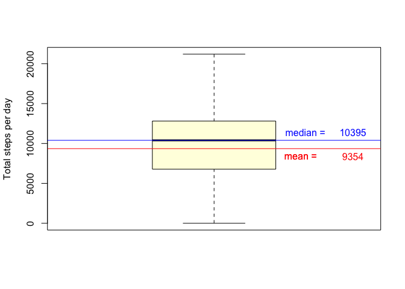

## Get Files and set working directory

1. Fork the depository, [GitHub](https://github.com/LifeIsFun/datasciencecoursera/tree/master/ReproducibleResearch1)
2. Set your local working directory, the following code is an example of mine.

```r
setwd("~/Desktop/RRef/DataScienceCoursera/ReproducibleResearch1")
```


## Loading and preprocessing the data

1. Data file is included in the directory.  Unzip the data.


```r
unzip("activity.zip",exdir = "data")
```

```
## Warning in unzip("activity.zip", exdir = "data"): error 1 in extracting
## from zip file
```

2. Read and view the data file

```r
data <- read.csv("activity.csv")

sapply(data, class)
```

```
##     steps      date  interval 
## "integer"  "factor" "integer"
```

3. Date has factor class.  Convert it to date.

```r
data$date <- as.Date(data$date, '%Y-%m-%d')
```

4. View the data

```r
str(data)
```

```
## 'data.frame':	17568 obs. of  3 variables:
##  $ steps   : int  NA NA NA NA NA NA NA NA NA NA ...
##  $ date    : Date, format: "2012-10-01" "2012-10-01" ...
##  $ interval: int  0 5 10 15 20 25 30 35 40 45 ...
```

```r
summary(data)
```

```
##      steps             date               interval     
##  Min.   :  0.00   Min.   :2012-10-01   Min.   :   0.0  
##  1st Qu.:  0.00   1st Qu.:2012-10-16   1st Qu.: 588.8  
##  Median :  0.00   Median :2012-10-31   Median :1177.5  
##  Mean   : 37.38   Mean   :2012-10-31   Mean   :1177.5  
##  3rd Qu.: 12.00   3rd Qu.:2012-11-15   3rd Qu.:1766.2  
##  Max.   :806.00   Max.   :2012-11-30   Max.   :2355.0  
##  NA's   :2304
```


## What is mean total number of steps taken per day?
Plot histogram of total number of steps per day.  Report mean and median of total number of steps taken per day

1. Calculate total steps per day

```r
tot.step <- tapply(data$steps, data$date, sum, na.rm = T)
```

2. Plot histogram

```r
hist(tot.step, 
     breaks = 10,
     col = "lightgreen",
     main = "",
     xlab = "Total steps per day")
```

<!-- -->

3. Calculate and display mean and median total steps / day.

```r
mean.tot.step <- mean(tot.step, na.rm = T)
median.tot.step <- median(tot.step, na.rm = T)

boxplot(tot.step,
        ylab = "Total steps per day",
        col = "lightyellow")
text(1.285,  mean.tot.step - 1000, labels = "mean = ", col = "red" ) 
abline(h = mean.tot.step,
        col = "red")
abline(h = median.tot.step,
        col = "blue")
text(1.285,  mean.tot.step - 1000, labels = "mean = ", col = "red" ) 
text(1.45, mean.tot.step - 1000, labels = floor(mean.tot.step), col = "red" ) 
text(1.3,  median.tot.step + 1000, labels = "median = ", col = "blue" ) 
text(1.45, median.tot.step + 1000, labels = floor(median.tot.step), col = "blue" ) 
```

<!-- -->


## What is the average daily activity pattern?
1. Create time series plot, type = 'l' of average step (averaged over each day) vs. 5-min interval.

```r
interval.step <- tapply(data$steps, data$interval, mean, na.rm = T)
interval <- as.numeric(dimnames(interval.step)[[1]])

plot(interval, interval.step, 
     xaxt = 'n', 
     type = 'l',
     main = "Average Steps per 5-min time interval",
     xlab = "5-min time interval",
     ylab = "Average Steps")
axis(1, at = seq(0, max(interval), 500 ) )
```

<!-- -->

2. Which 5-minute interval, on average across all the days in the dataset, contains the maximum number of steps

```r
interval.step[which.max(interval.step)]
```

```
##      835 
## 206.1698
```

Interval 835 has maximum average number of steps.  The value is 206 steps.

## Imputing missing values
There are many days/intervals where there are missing values (coded as NA). The presence of missing days may introduce bias into some calculations or summaries of the data.

1. Calculate and report the total number of missing values in the dataset (i.e. the total number of rows with NAs)

```r
missing <- is.na(data$steps)
paste("missing values = ", sum(missing) )
```

```
## [1] "missing values =  2304"
```


2. Devise a strategy for filling in all of the missing values in the dataset. The strategy does not need to be sophisticated. For example, you could use the mean/median for that day, or the mean for that 5-minute interval, etc.

We use mean for the interval to overrride NA

```r
# new column with mean 5 min data
data$mean5min <- tapply(data$steps, data$interval, mean, na.rm = T)

# new column with NA replaced by 5min mean
data$complete.steps <- ifelse(!is.na(data$steps) , data$steps, data$mean5min)
```


3. Create a new dataset that is equal to the original dataset but with the missing data filled in.

```r
data.complete <- data.frame(steps = data$complete.steps, date = data$date, interval = data$interval)
```


4. Make a histogram of the total number of steps taken each day and Calculate and report the mean and median total number of steps taken per day. Do these values differ from the estimates from the first part of the assignment? What is the impact of imputing missing data on the estimates of the total daily number of steps?

Calculate total steps per day

```r
tot.step.complete <- tapply(data.complete$steps, data.complete$date, sum, na.rm = T)
```

Create histogram of total steps per day

```r
hist(tot.step.complete, 
     breaks = 10,
     col = "lightgreen",
     main = "",
     xlab = "Total steps per day")
```

<!-- -->


Calculate and display mean and median total steps / day.

```r
mean.tot.step.complete <- mean(tot.step.complete, na.rm = T)
median.tot.step.complete <- median(tot.step.complete, na.rm = T)

boxplot(tot.step.complete,
        ylab = "Total steps per day",
        col = "lightyellow")
abline(h = mean.tot.step.complete,
        col = "red")
abline(h = median.tot.step.complete,
        col = "blue")
text(1.285,  mean.tot.step.complete - 1000, labels = "mean = ", col = "red" ) 
text(1.45, mean.tot.step.complete - 1000, labels = floor(mean.tot.step.complete), col = "red" ) 
text(1.3,  median.tot.step.complete + 1000, labels = "median = ", col = "blue" ) 
text(1.45, median.tot.step.complete + 1000, labels = floor(median.tot.step.complete), col = "blue" ) 
```

<!-- -->

After data transformation, mean and median are equal to each ather and have a value of 10766 steps per day.  Both values are higher than the original values as follows:


```r
ave.values <- data.frame(original = c(mean.tot.step, median.tot.step),
                         modified = c(mean.tot.step.complete, median.tot.step.complete) )
ave.values$diff <- ave.values$original - ave.values$modified
rownames(ave.values) <- c("mean", "median")
floor(ave.values)
```

```
##        original modified  diff
## mean       9354    10766 -1412
## median    10395    10766  -372
```


## Are there differences in activity patterns between weekdays and weekends?
For this part the weekdays() function may be of some help here. Use the dataset with the filled-in missing values for this part.

1. Create a new factor variable in the dataset with two levels -- "weekday" and "weekend" indicating whether a given date is a weekday or weekend day.

```r
# new column, if weekday starts with S, T, else F
# T = weekend
# F = weekday
# convert to factor
data.complete$weekday <-  factor(ifelse(grepl("^S", weekdays(data.complete$date) ),
            "weekend", "weekday") )
```


2. Make a panel plot containing a time series plot (i.e. type = "l") of the 5-minute interval (x-axis) and the average number of steps taken, averaged across all weekday days or weekend days (y-axis). The plot should look something like the following, which was created using simulated data:


```r
interval.step.day <- aggregate(steps ~ interval + weekday, data.complete, mean)

require(ggplot2)
```

```
## Loading required package: ggplot2
```

```r
ggplot(interval.step.day, aes(interval, steps)) + geom_line() + facet_grid(weekday ~ .) + 
    xlab("5-minute interval") + ylab("Average steps / interval")
```

<!-- -->

