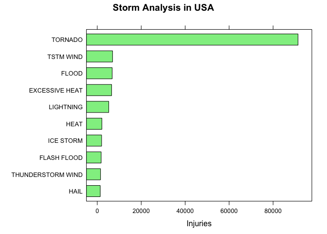
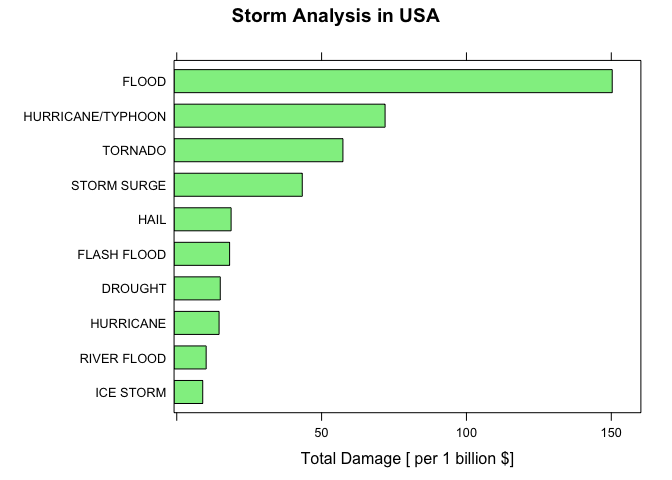

# Assignment
In this analysis NOAA Storm Database is used to assess:

1. Across the United States, which types of events (as indicated in the 𝙴𝚅𝚃𝚈𝙿𝙴 variable) are most harmful with respect to population health?

2. Across the United States, which types of events have the greatest economic consequences?

Presentation is limited to 3 plots.

# Synopsis
This report explores U.S. National Oceanic and Atmospheric Administration's (NOAA) storm database (1950-2011). Top 10 events having the most harmful effects on human population in terms of injuries and fatalities were identified.  Also top 10 events associated with highest economic damage were identified.  The data is presented using bar charts.  Additionally,  states experiencing the most amount of distress are presented in table format.

It was determined that tornado is the most significant weather event in terms of impact on population. It is associated with 5,633 deaths and 91,346 injuries.  Flood is the most damaging event causing \$150 billion in property and crop damage in that time frame.  In terms of impact on particular states, heat in IL is associated with most amount of deaths, 653.  Tornado in TX is associated with the most amount of injuries, 8207 and flood in CA caused \$117 billion in economic damage.


# Data Processing

## Get the file and set working directory
1. The data can be downloaded from [Storm Data](https://d396qusza40orc.cloudfront.net/repdata%2Fdata%2FStormData.csv.bz2).  For this analysis, it was downloded by clicking on the link and moved into working directory.

[Storm data documentation](https://d396qusza40orc.cloudfront.net/repdata%2Fpeer2_doc%2Fpd01016005curr.pdf) is avialable here.

2. Set your local working directory, the following code is an example of mine.

```r
setwd("~/Desktop/RRef/DataScienceCoursera/ReproducibleResearch2")
```


## Loading and preprocessing the data

1. Read data file

```r
data <- read.csv("repdata-data-StormData.csv.bz2", header = TRUE, sep = ",")
```


2. View the data and reduce data to columns of interest

```r
storm.data <- data[, c('STATE','EVTYPE', 'FATALITIES', 'INJURIES', 'PROPDMG', 'PROPDMGEXP', 'CROPDMG', 'CROPDMGEXP')]
str(storm.data)
```

```
## 'data.frame':	902297 obs. of  8 variables:
##  $ STATE     : Factor w/ 72 levels "AK","AL","AM",..: 2 2 2 2 2 2 2 2 2 2 ...
##  $ EVTYPE    : Factor w/ 985 levels "   HIGH SURF ADVISORY",..: 834 834 834 834 834 834 834 834 834 834 ...
##  $ FATALITIES: num  0 0 0 0 0 0 0 0 1 0 ...
##  $ INJURIES  : num  15 0 2 2 2 6 1 0 14 0 ...
##  $ PROPDMG   : num  25 2.5 25 2.5 2.5 2.5 2.5 2.5 25 25 ...
##  $ PROPDMGEXP: Factor w/ 19 levels "","-","?","+",..: 17 17 17 17 17 17 17 17 17 17 ...
##  $ CROPDMG   : num  0 0 0 0 0 0 0 0 0 0 ...
##  $ CROPDMGEXP: Factor w/ 9 levels "","?","0","2",..: 1 1 1 1 1 1 1 1 1 1 ...
```
Data Description:

 - State:      abreviation of state  
 - EVTYPE:     event type, like tornado, heat, flash flood
 - FATALITIES: number of fatalities
 - INGURIES:   number of injuries
 - PROPDMG:    value (magnitude) of property damage
 - PROPDMGEXP: units for PROPDMG: -1:8 = 10^(-1:8), h | H = 10^2, K = 10^3, m | M = 10^4, B = 10^5
 - CROPDMG:    value (magnitude) of property damage
 - CROPDMGEXP: units for CROPDMG: : -1:8 = 10^(-1:8), h | H = 10^2, K = 10^3, m | M = 10^6, B = 10^9

3. Modify damage data to uniform values, simplify data to columns used in presentation.

- identify levels

```r
cat("Property damage factors = ", levels(storm.data$PROPDMGEXP), "\n" )
```

```
## Property damage factors =   - ? + 0 1 2 3 4 5 6 7 8 B h H K m M
```

```r
cat("Crop damage factors = ", levels(storm.data$CROPDMGEXP), "\n" )
```

```
## Crop damage factors =   ? 0 2 B k K m M
```

- for consistancy, make all damage factors upper case 

```r
storm.data$PROPDMGEXP <- toupper(storm.data$PROPDMGEXP)
storm.data$CROPDMGEXP <- toupper(storm.data$CROPDMGEXP)
```

- create function to assign values to factors


```r
## note, dplyr interfares with car version of recode.

unit <- function(x) {
    recode(x,
        " 
          '-' = 10^(-1);
          '+' = 10^(0);
          '?' = 10^(0);
          '0' = 10^0;
          '1' = 10^1;
          '2' = 10^2;
          '3' = 10^3;
          '4' = 10^4;
          '5' = 10^5;
          '6' = 10^6;
          '7' = 10^7;
          '8' = 10^8;
          'H' = 10^2;
          'K' = 10^3;
          'M' = 10^6;
          'B' = 10^9  ")
}
```

- assign unit conversion function to data.frame and calculate property and crop damage values

```r
## apply unit function
storm.data$PROPDMG.VALUE <- unit(storm.data$PROPDMGEXP)
storm.data$CROPDMG.VALUE <- unit(storm.data$CROPDMGEXP)

## convert to numeric
storm.data$PROPDMG.VALUE <- as.numeric(storm.data$PROPDMG.VALUE)
storm.data$CROPDMG.VALUE <- as.numeric(storm.data$CROPDMG.VALUE)

## calculate damage value and remove NA
storm.data$PROPDMG.VALUE <- storm.data$PROPDMG.VALUE * storm.data$PROPDMG
storm.data$PROPDMG.VALUE <- ifelse(is.na(storm.data$PROPDMG.VALUE), 0, storm.data$PROPDMG.VALUE)

storm.data$CROPDMG.VALUE <- storm.data$CROPDMG.VALUE * storm.data$CROPDMG
storm.data$CROPDMG.VALUE <- ifelse(is.na(storm.data$CROPDMG.VALUE), 0, storm.data$CROPDMG.VALUE)

## total damage
storm.data$TOTAL.VALUE <- storm.data$PROPDMG.VALUE + storm.data$CROPDMG.VALUE
```

- select used columns only


```r
storm.data <- select(storm.data, STATE, EVTYPE, FATALITIES, INJURIES, TOTAL.VALUE)
```

# Results
1. Across the United States, which types of events (as indicated in the 𝙴𝚅𝚃𝚈𝙿𝙴 variable) are most harmful with respect to population health?

- Fatalities data


```r
fatalities <- tapply(storm.data$FATALITIES, storm.data$EVTYPE, sum, na.rm = T)

# get 10 largest values
fatalities <- sort(fatalities, decreasing = T)[1:10]

#bar plot, sort to get largest values on top 
barchart(~sort(fatalities),
         col = "lightgreen",
         main = "Storm Analysis in USA",
         xlab = "Fatalities")
```

<!-- -->

- Injuries data

```r
injuries <- tapply(storm.data$INJURIES, storm.data$EVTYPE, sum, na.rm = T)

# get 10 largest values
injuries <- sort(injuries, decreasing = T)[1:10]

#bar plot, largest values on top 
barchart(~sort(injuries),
         col = "lightgreen",
         main = "Storm Analysis in USA",
         xlab = "Injuries")
```

<!-- -->

```r
# aggregate fatalities data per state and per event type
fatalities.state <- aggregate(FATALITIES~EVTYPE + STATE, storm.data, FUN= function(x) sum(x))

# top 10 fatalities
fatalities.state[order(fatalities.state$FATALITIES, decreasing = T)[1:10], ]
```

```
##              EVTYPE STATE FATALITIES
## 1154           HEAT    IL        653
## 152         TORNADO    AL        617
## 3691        TORNADO    TX        538
## 2045        TORNADO    MS        450
## 1982        TORNADO    MO        388
## 214         TORNADO    AR        379
## 3569        TORNADO    TN        368
## 3087 EXCESSIVE HEAT    PA        359
## 1130 EXCESSIVE HEAT    IL        330
## 2992        TORNADO    OK        296
```

```r
# aggregate injury data per state and per event type
injuries.state <- aggregate(INJURIES~EVTYPE + STATE, storm.data, FUN= function(x) sum(x))

# top 10 fatalities
injuries.state[order(injuries.state$INJURIES, decreasing = T)[1:10], ]
```

```
##       EVTYPE STATE INJURIES
## 3691 TORNADO    TX     8207
## 152  TORNADO    AL     7929
## 3608   FLOOD    TX     6338
## 2045 TORNADO    MS     6244
## 214  TORNADO    AR     5116
## 2992 TORNADO    OK     4829
## 3569 TORNADO    TN     4748
## 2866 TORNADO    OH     4438
## 1982 TORNADO    MO     4330
## 1264 TORNADO    IN     4224
```


2. Across the United States, which types of events have the greatest economic consequences?
- Bar plot of top 10 events

```r
## property damage
tot.damage <- tapply(storm.data$TOTAL.VALUE, storm.data$EVTYPE, sum, na.rm = T)

# get 10 largest values
tot.damage <- sort(tot.damage, decreasing = T)[1:10]

tot.damage <- tot.damage /1000000000

#bar plot, largerst values on top 
barchart(~sort(tot.damage),
         col = "lightgreen",
         main = "Storm Analysis in USA",
         xlab = "Total Damage [ per 1 billion $]")
```

<!-- -->

- table of top 10 events per state

```r
# aggregate injury data per state and per event type
tot.damage.state <- aggregate(TOTAL.VALUE~EVTYPE + STATE, storm.data, FUN= function(x) sum(x))

# convert damage to per billion dollars.
tot.damage.state$TOTAL.VALUE <- round(tot.damage.state$TOTAL.VALUE / 1000000000)

# top 10 fatalities
tot.damage.state[order(tot.damage.state$TOTAL.VALUE, decreasing = T)[1:10], ]
```

```
##                 EVTYPE STATE TOTAL.VALUE
## 335              FLOOD    CA         117
## 1471       STORM SURGE    LA          32
## 757  HURRICANE/TYPHOON    FL          29
## 1463 HURRICANE/TYPHOON    LA          21
## 2031 HURRICANE/TYPHOON    MS          15
## 2036       STORM SURGE    MS          11
## 1172       RIVER FLOOD    IL          10
## 3593           DROUGHT    TX           7
## 152            TORNADO    AL           6
## 2176         HURRICANE    NC           6
```

